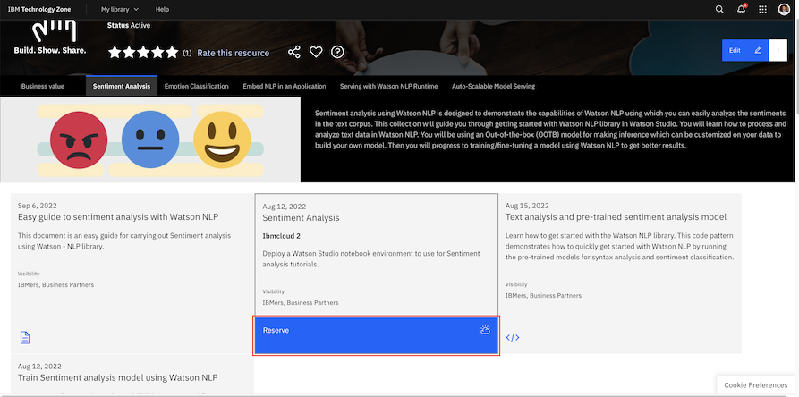

## Getting Started with Watson NLP on TechZone

This guide will help you to set up Watson NLP in a Python notebook environment, using Watson Studio.

### Steps:
#### Reserve your env
1. Scroll down the page [Techzone page for sentiment analysis]([https://techzone.ibm.com/collection/62c8a7c338d3d90017049a70](https://techzone.ibm.com/collection/watson-core-nlp#tab-1)) and click the **Reserve** button to reserve a Watson Studio environment.

2. You will receive an email inviting you to join the IBM cloud account. Once your environment is ready (within a few minutes) you will recieve a notification similar to the following.

3. Once you login and go to the Watson Studio project, you should be able to view the notebooks and data assets in your project on the **Assets** tab.

4. Click on the **Manage** tab now.

5. Click on **Environments** from the side Navbar and then click on **Templates** tab. Click on **New template**

6. Now create an env for making `watson_nlp` library available in the Watson Studio. (It is available by default as an extra small option but you might need a bigger environment for this dataset and model training as well). 
Name your enviroment as something meaniningful like **Watson NLP**. In the Hardware configuration, select at least **4 vCPU and 16 GB RAM** for the pre-trained model (OOB sentiment analysis model notebook) and probably a bigger one for model training notebook. Then select **Default Python 3.8 + Watson NLP(beta)** in the Software version. If you do not select this software version, `watson_nlp` library will not be available in the Watson Studio Notebooks. Finally click **Create**

7. Once the env is created, click on the **Assets** tab. Then click on the 3 dots at the right end of the notebook and click on **Change environment**

8. Select the enviroment you created in the previous step and click on **Change**

9. Now you should be able to run the notebook by clicking on the 3 dots and then selecting **Edit** (Note: You need to repeat this step for all the notebooks you have in the project)

10. Your notebook will load and you can follow the instructions in your notebook for complete the tutorials on Watson NLP

