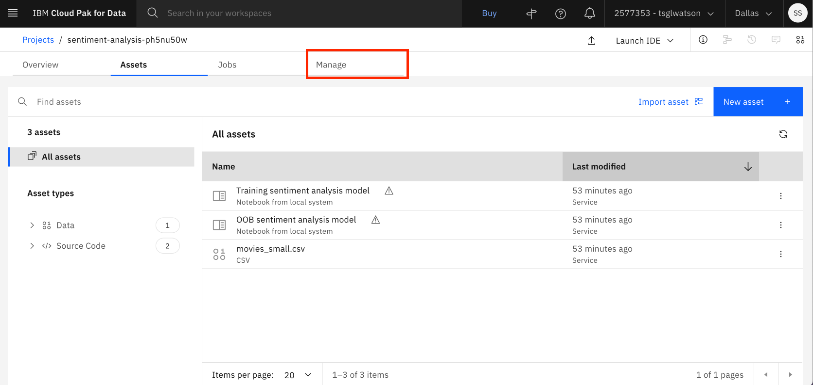
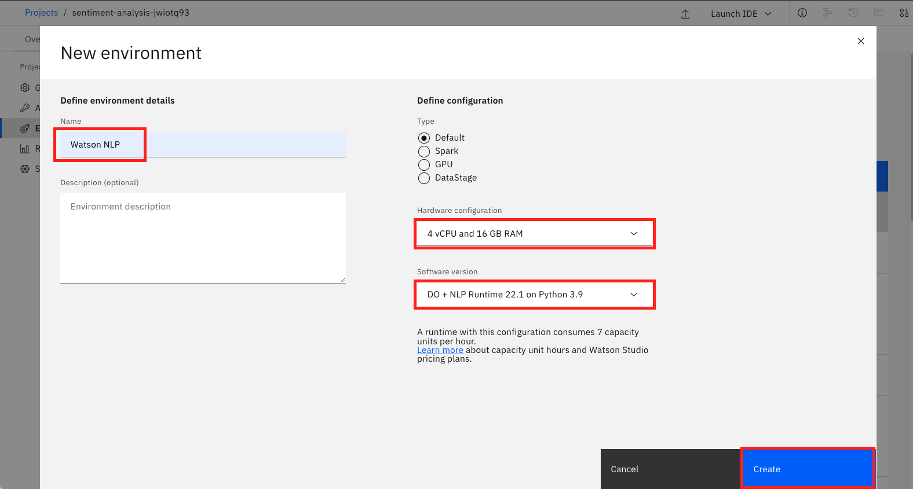
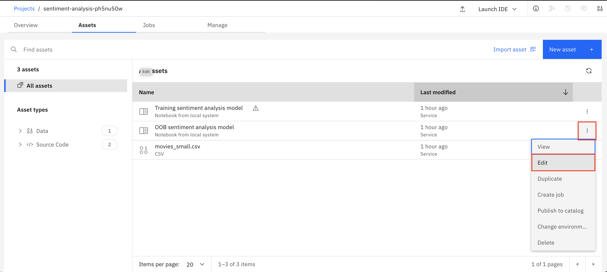

## Getting Started with Watson NLP on TechZone

This guide will help you to set up Watson NLP in a Python notebook environment, using Watson Studio.  For the guide, we show how to set up the environment for the Sentiment analysis tutorial.  The flow for Emotion Classification is similar.

### Steps:
#### Reserve your env
1. Under the [Sentiment Analysis](https://techzone.ibm.com/collection/watson-core-nlp#tab-1) tab, find the environment tile and click **Reserve** to reserve a Watson Studio environment.

2. Shortly, you will receive an email inviting you to join an IBM cloud account. Follow the instructions in the email to join.  Your environment should be ready within a few minutes.  Once it is ready, you will recieve a second email similar to the following.

3. Log in to [IBM Cloud Pak for Data](https://dataplatform.cloud.ibm.com). Once logged in, ensure that you are using cloud account **2577353 - tsglwatson** as given in the email. You can check the name of the current account in the bar the top of the screen.  Change the account if necessary using the drop-down menu.  From the IBM Cloud Pak for Data dashboad, find the tile for the Project you want to work with.  For the Sentiment Analysis tutorial, the name of this Project will have the prefix **sentiment-analysis**.  Once the Project is open, you can view the notebooks and data assets of the project with the **Assets** tab.

4. We will create a new environment template. Click on the **Manage** tab.

5. Click on **Environments** from the side Navbar. Next click on **Templates** tab. Finally, click on **New template**

6. In this step, we will create an environment template that contains the Watson NLP library. Give your environment template a name like **Watson NLP**. In the Hardware configuration, select at least **4 vCPU and 16 GB RAM**. For Software, select **Default Python 3.8 + Watson NLP(beta)**. Finally click **Create**

7. Once the environment template is created, click on the **Assets** tab. Find the notebook you want to work with among the assets.  Click on the ellipsis (the three dots) at the right end of the notebook to open a drop-down menu.  Click **Change environment** in menu.

8. Select the environment template that you created previously and click **Change*.
 

9. Now, you will be able to run the notebook by clicking the ellipsis and selecting **Edit**.  Note that you need to repeat this step for all the notebooks you have in the project.

10. Your notebook will load and you can follow the instructions in your notebook to complete the tutorials on Watson NLP.

