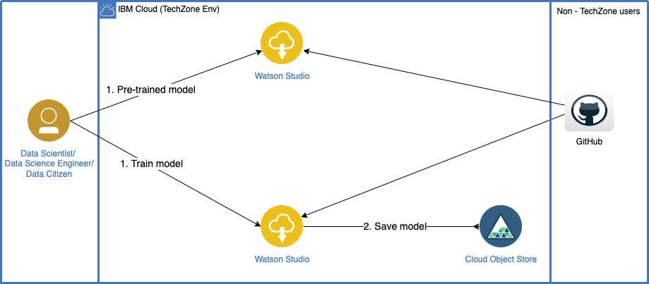
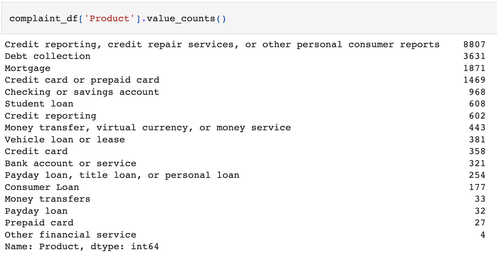
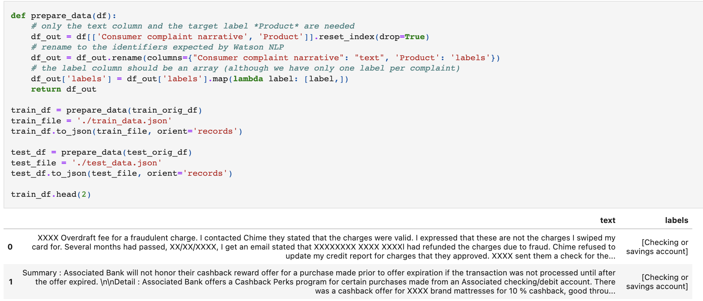
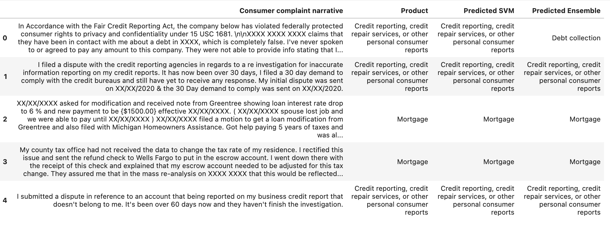
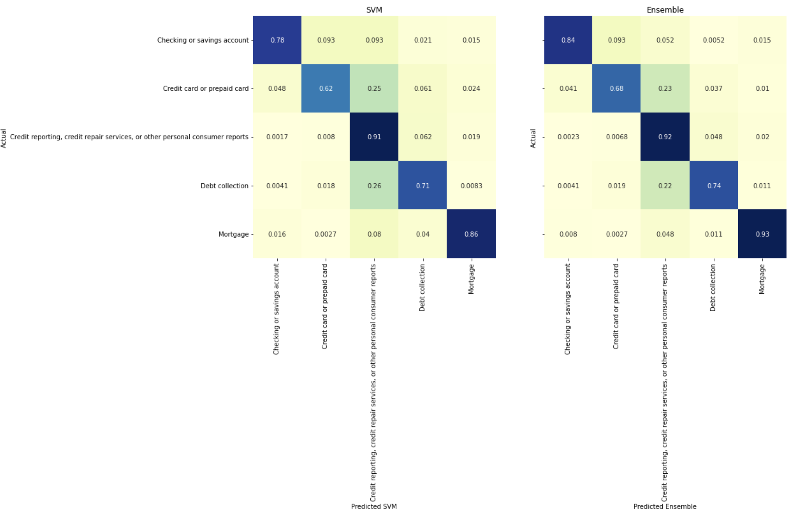

# Easy guide to Text Classification with Watson NLP

With IBM Watson libraries, IBM introduced a common library for artificial intelligence (AI) runtimes (for serving the model) and AI libraries (like Natural Language Processing, Document Understanding, Translation, and Trust). IBM Watson libraries brings everything under one umbrella for consistency and ease of development and deployment. This tutorial walks you through the steps of training a model to classify text in consumer complaints using the `watson_nlp` library from IBM Watson NLP.

The `watson_nlp` library is available on IBM Watson Studio as a runtime library so that you can directly use it for model training, evaluation, and prediction. The following figure shows the Watson NLP NLP architecture.



IBM Watson NLP is a standard embeddable AI library that is designed to tie together the pieces of IBM Natural Language Processing. It provides a standard base natural language processing layer along with a single integrated roadmap, a common architecture, and a common code stack designed for widespread adoption across IBM products.

Text Classification is usually manually processed by humans to gather groups of qualitative data. Having the ability to automatically gather and process larger data sets of text through customer feedback, comments, or an entire article written on your product is a strong tool to gain insight into the most common emotional responses in a group of people or a block of text.

IBM Watson NLP now provides the ability to automatically classify the input text into one or more of pre-determined set of labels. We are able to infer upon a certain emotion through syntax analysis and the emotion workflows provided by IBM AI libraries by using pretrained and custom models.

This tutorial explains the fundamentals of IBM Watson NLP and walks you through the process of training and evaluating the models to perform text classification.

## Prerequisites

To follow the steps in this tutorial, you need:

* An [IBMid](https://cloud.ibm.com/login?cm_sp=ibmdev-_-developer-tutorials-_-cloudreg)
* A Watson Studio project
* A [Python notebook](https://github.com/ibm-build-labs/Watson-NLP/blob/main/Emotion-Classification/Emotion%20Classification%20-%20Pre-Trained%20Models.ipynb)
* Your [environment set up](https://developer.ibm.com/tutorials/set-up-your-ibm-watson-libraries-environment/)

* **What are the helper libraries that you need to import?**

Before working through the tutorial, you should have an understanding of IBM Watson Studio and Jupyter Notebooks.

## Estimated time

It should take you approximately 1 hour to complete this tutorial.

## Steps

The steps in this tutorial use an example of IMDB movie reviews from Kaggle to walk you through the process.

### Step 1. Data processing and exploratory data analysis

1. The data is publicly available at [Consumer Complaint Database
](https://www.consumerfinance.gov/data-research/consumer-complaints/). The dataset has been downloaded and saved in the [Box folder](https://ibm.box.com/shared/static/u88jxenp0ia7q9e0ac5d84xqf3vak1mm.csv) for you.

2. Downsample the dataset to reduce model training time and quick analysis

```complaint_df = complaint_df.sample(frac=0.02)```

3. Let's look at all product groups that are available in the data set because these are the classes that the classifier should predict from a given complaint text.

    

4. Many classification algorithms work best if the training samples are equally split across the classes. If the data is unbalanced, algorithms might decide to favor classes with many samples to achieve an overall good result. So, in the next step you will filter on the Product categories with relevant number of samples and remove any other product category from further analaysis.

```
train_test_df = complaint_df[(complaint_df['Product'] == 'Credit reporting, credit repair services, or other personal consumer reports') | \
                             (complaint_df['Product'] == 'Debt collection') | \
                             (complaint_df['Product'] == 'Mortgage') | \
                             (complaint_df['Product'] == 'Credit card or prepaid card') | \
                             (complaint_df['Product'] == 'Checking or savings account')
                            ]
```

5. In the next step, you will split the data into training and test data (ratio:80/20).

```
# 80% training data
train_orig_df = train_test_df.groupby('Product').sample(frac=0.8, random_state=6)
print("Training data:")
print("Number of training samples: {}".format(len(train_orig_df)))
print("Samples by product group:\n{}".format(train_orig_df['Product'].value_counts()))

# 20% test data
test_orig_df = train_test_df.drop(train_orig_df.index)
print("\nTest data:")
print("Number of test samples: {}".format(len(test_orig_df)))
print("Samples by product group:\n{}".format(test_orig_df['Product'].value_counts()))

# re-index after sampling
train_orig_df = train_orig_df.reset_index(drop=True)
test_orig_df = test_orig_df.reset_index(drop=True)
```

You have created two dataframes, one for the training and one for the test data. The data is still in its original format. Now you need to bring the data into a format that is usable by the Watson NLP classification algorithms. This can be either JSON or CSV format.

5. In the next step, you will create the data in *JSON* format. The training and test data is written to files.

    

### Step 2. Model building

#### Step 2A. Train a SVM classification model with Watson NLP

    SVM is an established classification approach. Watson NLP includes an SVM algorithm that exploits the SnapML libraries for faster training. The algorithm utilizes USE embeddings that encode word-level semantics into a vector space.


1. The SVM classifier block depends on the syntax block. So, start by loading the syntax model and the USE embeddings.

```
# Syntax Model
syntax_model = watson_nlp.load(watson_nlp.download('syntax_izumo_en_stock'))
# USE Embedding Model
use_model = watson_nlp.load(watson_nlp.download('embedding_use_en_stock'))
```

2. Classification blocks expect the training data in data streams. You can create data streams using several utility methods, as shown below.

```
training_data_file = train_file

# Create datastream from training data
data_stream_resolver = DataStreamResolver(target_stream_type=list, expected_keys={'text': str, 'labels': list})
training_data = data_stream_resolver.as_data_stream(training_data_file)

# Create Syntax stream
text_stream, labels_stream = training_data[0], training_data[1]
syntax_stream = syntax_model.stream(text_stream)

use_train_stream = use_model.stream(syntax_stream, doc_embed_style='raw_text')
use_svm_train_stream = watson_nlp.data_model.DataStream.zip(use_train_stream, labels_stream)
```

3. Train the classifier.

```
svm_model = SVM.train(use_svm_train_stream)
```

#### Step 2B. Train an ensemble classification model with Watson NLP
The ensemble model combines three classification models:

- CNN
- SVM with TF-IDF features
- SVM with USE (Universal Sentence Encoder) features

It computes the weighted mean of classification predictions using confidence scores. You will use the default weights which can be fine-tuned in subsequent steps.

The ensemble workflow is very easy to use and the model performance can be a lot better than individual algorithms.

It depends on the syntax model and the GloVe and USE embeddings. They are passed with the file containing the training data.

1. Train the ensemble classifier. Note: To restrict the time, we limited the epochs to train the CNN classifier to 5. This is an optional attribute - if not specified, the default will be 30 epochs.

```
stopwords = watson_nlp.download_and_load('text_stopwords_classification_ensemble_en_stock')

ensemble_model = Ensemble.train(train_file, 'syntax_izumo_en_stock', 'embedding_glove_en_stock', 'embedding_use_en_stock', stopwords=stopwords)
```

#### Step 2C. Store and load classification models (optional)
You can save a model as a project asset. model.as_file_like_object() creates a ZIP archive, which is provided as a BytesIO object that is stored in the project.

1. Save both models in your project.
```
project.save_data('svm_model', data=svm_model.as_file_like_object(), overwrite=True)
```

```
project.save_data('ensemble_model', data=ensemble_model.as_file_like_object(), overwrite=True)
```

### Step 3. Model evaluation

Now you are able to run the trained models on new data. You will run the models on the test data so that the results can also be used for model evaluation. For illustration purposes, the data is used in the original format that you started out with because the format of the new complaints that you receive might also be in that format.

1. Create a helper method to run both models on a single complaint and return the predicted product groups of both models. Notice that the SVM model requires you to run the syntax model on the input texts first.


```
def predict_product(text):
    # run syntax model first
    syntax_result = syntax_model.run(text)
    # run SVM model on top of syntax result
    svm_preds = svm_model.run(use_model.run(syntax_result, doc_embed_style='raw_text'))
    
    predicted_svm = svm_preds.to_dict()["classes"][0]["class_name"]
    
    ensemble_preds = ensemble_model.run(text)
    predicted_ensemble = ensemble_preds.to_dict()["classes"][0]["class_name"]
    return (predicted_svm, predicted_ensemble)
```

2. Run the models on the complete test data.
    

3. Plot a confusion matrix for the classifiers.
    

You can see that the precision, recall and f1-measure for some classes is much lower than for others. The reason might be that it is difficult to differentiate between some classes.

Overall, the ensemble model performs better than the SVM model. However, the SVM model had a significantly shorter training time.


## Conclusion

This notebook shows you how to use the Watson NLP library and how quickly and easily you can train and run different text classifiers using Watson NLP.

## Next steps

You can run this <a href="https://github.com/ibm-build-labs/Watson-NLP/blob/main/Social-Media-Analytics/Hotel%20Reviews%20Text%20Classification.ipynb" target="_blank" rel="noopener noreferrer">Jupyter Notebook</a> to see how training a text classification model using Watson NLP works. The notebook demonstrates how to train text classification model on hotel reviews using Watson Natural Language Processing.

In this notebook, you will learn how to prepare your data, train a custom SVM model and an ensemble model, save the model and score data and compare model quality on test data.
