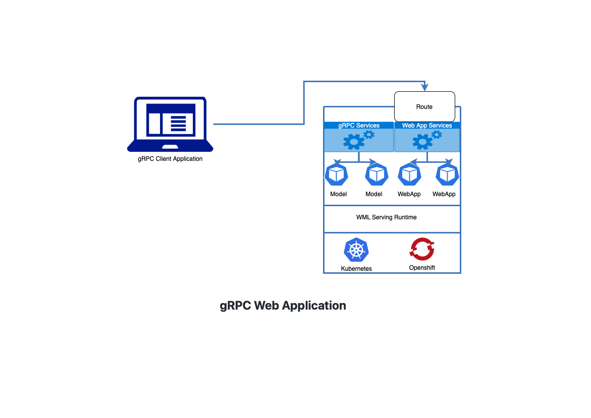

# Watson NLP Python Client 
In this tutorial you will build and deploy a Watson NLP client application.  The sample client application is a web service built in Python that performs Emotion Classification on user-supplied texts.  The client application uses the Watson NLP Python SDK to interact with a back-end model service. You can adapt the sample code from this tutorial to your own projects.

This tutorial follows from previous tutorials serving Emotion Classification models. You should have a model service that is serving Watson NLP Classification models. The default configuration uses the models: 
- `ensemble_classification-wf_en_emotion-stock`

## Architecture Diagram



## Prerequisites
- [Docker Desktop](https://docs.docker.com/get-docker/) is installed
- [Python 3.9](https://www.python.org/downloads/) or later is installed
- [Watson NLP Runtime Python client library](https://github.com/ibm-build-labs/Watson-NLP/blob/main/access/README.md#python) is installed

**Tip**:
- [Podman](https://podman.io/getting-started/installation) provides a Docker-compatible command line front end. Unless otherwise noted, all the the Docker commands in this tutorial should work for Podman, if you simply alias the Docker CLI with `alias docker=podman` shell command.

## Steps
### 1. Clone the GitHub repository
Clone the repository that contains the sample code used in this tutorial. 
```
git clone https://github.com/ibm-build-labs/Watson-NLP
```
Go to the root directory for this tutorial.
```
cd Watson-NLP/MLOps/Dash-App-GRPC
```
### 2. Install the client library
Run the following command to install the Watson NLP Python client library.  
```
pip3 install watson_nlp_runtime_client 
```
This is a packaged gRPC stub library that is used to communicate with the Watson NLP Runtime. 

### 3. Build docker image
There is a Dockerfile in the root directory for this tutorial. Build the container image with the following command. 
```
docker build -t dash-app-grpc:latest . 
```
This results in an image named `dash-app-grpc:latest`.

### 4. Run with Docker
In this section, we give the steps to run your application front-end locally using Docker. If you instead want to run it on your Kubernetes or OpenShift cluster, skip ahead to the next step.

#### 4.1 Enable port forwarding
If your model service is running on a Kubernetes or OpenShift cluster, then enable port forwarding from your local machine to that cluster. If this is not the case, then skip this step.

In Kubernetes:
```
kubectl port-forward svc/watson-nlp-container 8085 
```
For OpenShift:
```
oc port-forward svc/watson-nlp-container 8085
```

#### 4.2 Start the web service
Set the following environment variables:
- `GRPC_SERVER_URL`: Set this to the gRPC endpoint model service. The default value is `localhost:8085`. 
- `EMOTION_CLASSIFICATION_STOCK_MODEL`: Set this to the name of the emotion classification model being served. Default value is `ensemble-classification-wf-en-emotion-stock`.
- `NLP_MODEL_SERVICE_TYPE`: This argument indicates the type of model serving platform. If you model is running in kubernetes as a container set the value as `mm-model-id`. If your model is running in a kserve/wml serving set the value as 'mm-vmodel-id'

Run this command to start the web service.
```
docker run \
-e GRPC_SERVER_URL=${GRPC_SERVER_URL} \
-e EMOTION_CLASSIFICATION_STOCK_MODEL=${EMOTION_CLASSIFICATION_STOCK_MODEL} \
-e NLP_MODEL_SERVICE_TYPE='mm-model-id' \
-p 8050:8050 dash-app-grpc:latest 
```

#### 4.3 Test
Use your browser to access the application at the following URL.
```
http://localhost:8050 
```

### 5. Run the application in your Kubernetes or OpenShift cluster 
In this section we discuss the steps to run the application on the same Kubernetes or OpenShift cluster in which your models are being served.

#### 5.1 Push the image to a container registry
First you will need to push the image to a container registry that can be accessed by your cluster. Run the following commands, changing the `<Image Registry>` and `<Project Name>` in the following commands based on your configuration. 
```
docker tag dash-app-grpc:latest <Image Registry>/<Project Name>/dash-app-grpc:latest 
```
```
docker push <Image Registry>/<Project Name>/dash-app-grpc:latest 
```

#### 5.2 Update the manifest
Starting at the root directory for this tutorial, go to the directory with the Kubernetes manifest.
```
cd deployment
```
There are three files in the directory.
- `config.yaml` 
- `deployment.yaml` 
- `service.yaml`

In `deployment.yaml` update the image line to point to the image that you pushed to a registry, i.e. change this line:
```
       image: image-registry.openshift-image-registry.svc:5000/openshift/dash-app-grpc:2022083111 
```
The format should be:
```
       image: <Image Registry>/<Project Name>/dash-app-grpc:latest` 
```

#### 5.3 Set environment variables
Set the following variables in your environment.

- `GRPC_SERVER_URL`: Set this to the gRPC endpoint of the model service. The value should have the form `<Service-Name>:<Port>`, e.g. `wml-serving:8033`. 
- `SENTIMENT_DOCUMENT_CNN_WORKFLOW_MODEL`: Set this to the name of the sentiment analysis model being served. Default value is `entiment-document-cnn-workflow-en-stock`.
- `EMOTION_CLASSIFICATION_STOCK_MODEL`: Set this to the name of the emotion classification model being served. Default value is `ensemble-classification-wf-en-emotion-stock`.
 
#### 5.3 Deploy 

**Kubernetes.** Execute the following command to deploy.
```
kubectl apply -f deployment/ 
```
Enable port-forward to the service in order to access it from your local machine.
```
kubectl port-forward svc/dash-app-grpc 8050 
```

**OpenShift.** Execute the below command to deploy.
```
oc apply -f deployment/ 
```
You can expose the service as a route, or you can do a port-forward to test the application as a route.
```
oc expose service/dash-app-grpc 
```
```
oc get route
```
Alternatively, you can port forward the service to access in localhost 
```
oc port-forward svc/dash-app-grpc 8050 
```

#### 5.4 Test
You can now access the application from your browser at the following URL. 
```
http://localhost:8050 
```


