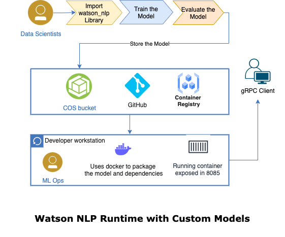

## Serve a Custom Model using Standalone Containers
In this tutorial you will take a Watson NLP model that you have trained in Watson Studio, package it into a container image together with the Watson NLP Runtime, and run this container with Docker. When the container runs it will expose REST and gRPC endpoints that client programs can use to make inference requests. 

This image could also be deployed on a Kubernetes or OpenShift cluster, or on a cloud container service like IBM Code Engine or AWS Fargate.

To complete this tutorial, you need to have first completed the [Consumer Complaint Classification](https://techzone.ibm.com/collection/watson-nlp-text-classification#tab-1) tutorial, which includes steps on training a custom ensemble model and saving it to the Cloud Object Storage (COS) bucket associated with the project.

### Architecture diagram


    
### Prerequisites
    
- [Docker Desktop](https://docs.docker.com/get-docker/) is installed
- [Python 3.9](https://www.python.org/downloads/) or later is installed
- Docker has access to the [Watson NLP Runtime and pretrained models](https://github.com/ibm-build-labs/Watson-NLP/blob/main/MLOps/access/README.md#docker)
- [Watson NLP Runtime Python client library](https://github.com/ibm-build-labs/Watson-NLP/blob/main/MLOps/access/README.md#python) is installed
- You have completed the [Consumer Complaint Classification](https://techzone.ibm.com/collection/watson-nlp-text-classification#tab-1) tutorial, and have saved the custom trained model named `ensemble_model` to the COS bucket associated with the project. The tutorial uses this [notebook](https://github.com/ibm-build-labs/Watson-NLP/blob/main/ML/Text-Classification/Consumer%20complaints%20Classification.ipynb).
    
**Tip**:
- [Podman](https://podman.io/getting-started/installation) provides a Docker-compatible command line front end. Unless otherwise noted, all the the Docker commands in this tutorial should work for Podman, if you simply alias the Docker CLI with `alias docker=podman` shell command.  
  
## Steps
### 1. Clone the GitHub repository
Clone the repository that contains the sample code used in this tutorial. 
```
git clone https://github.com/ibm-build-labs/Watson-NLP 
```
Go to the following directory.
```
cd Watson-NLP/MLOps/Watson-NLP-Custom-Model-Container/Runtime 
```
In this directory you will find a `Dockerfile` and a `models` subdirectory. When we build the container image, any models that are in the `models` directory will be copied into the image.

### 2. Download the model
Go to the page for your Consumer Complaints Classification project in the IBM Cloud Pak for Data GUI and click on the **Assets** tab. There you should find a model named `ensemble_mode` stored as a ZIP archive. 

If the model is not there, go back to the notebook and ensure that you have followed the steps in the notebook:
  - Insert a project token into the notebook, and
  - Run the cell that saves the model.
```
project.save_data('ensemble_model', data=ensemble_model.as_file_like_object(), overwrite=True)
```

Download the model into the *models* directory on your local machine. Use the vertical ellipsis to the right of the model name to open a menu with the download option. Ensure that you use the file name `ensemble_model` when saving the file.

### 3. Build the container image
Have a look at the Dockerfile in the current directory.
```
ARG WATSON_RUNTIME_BASE="wcp-ai-foundation-team-docker-virtual.artifactory.swg-devops.com/watson-nlp-runtime:0.13.1_ubi8_py39" 
FROM ${WATSON_RUNTIME_BASE} as base 
ENV LOCAL_MODELS_DIR=/app/models 
COPY models /app/models 
```
The Watson NLP Runtime is used as the base image. Any models that are in the `models` subdirectory on the host will be opein the container at build time.

Use the following command to build the image. 
```
docker build . -t watson-nlp-custom-container:v1 
```
This results in a image named `watson-nlp-custom-container:v1`.  Check that it exists.
```
docker images
```

### 4. Run the service with Docker
Use the following command to start the service. 
```
docker run -d -e ACCEPT_LICENSE=true -p 8085:8085 watson-nlp-custom-container:v1 
```
The container will expose a gRPC endpoint on port 8085. 

### 5. Test the service
Now test the model service using a client program. Ensure that the [Watson NLP Python SDK](https://github.com/ibm-build-labs/Watson-NLP/blob/main/access/README.md) is installed on your machine.

The client program appears in the directory `Watson-NLP/Watson-NLP-Custom-Model-Container/Client`. Note that the client code included with this tutorial will make inference requests to the sample model `ensemble_model`.  If using a different model, be sure to update the client code.

From the `Runtime` directory:
```
cd ../Client 
```

Execute the following commands to prepare your Python environment.
```
python3 -m venv client-env
```
```
source client-env/bin/activate
```
```
pip3 install watson-nlp-runtime-client==1.0.0
```
```
pip3 install PythonTurtle
```

Run the client program. This program takes a single text string as an argument.  The result from the model is printed to the screen.

```
python3 client.py "Watson NLP is awesome" 
```


### Note: 
If you see any error when running similar to the following: 
```
"/usr/local/Cellar/python@3.9/3.9.14/Frameworks/Python.framework/Versions/3.9/lib/python3.9/turtle.py", line 107, in <module>
    import tkinter as TK
  File "/usr/local/Cellar/python@3.9/3.9.14/Frameworks/Python.framework/Versions/3.9/lib/python3.9/tkinter/__init__.py", line 37, in <module>
    import _tkinter # If this fails your Python may not be configured for Tk
ModuleNotFoundError: No module named '_tkinter'
```
Please install python tk module based on your operating system and then rerun the client program `python3 client.py "Watson NLP is awesome"`

 === MacOS ===

```brew install python-tk@3.9```

=== UBUNTU / DEBIAN ===

```sudo apt-get install python3-tk```

=== Fedora ===

```sudo dnf install python3-tkinter```

=== CentOS ===

```sudo yum install python3-tkinter```
