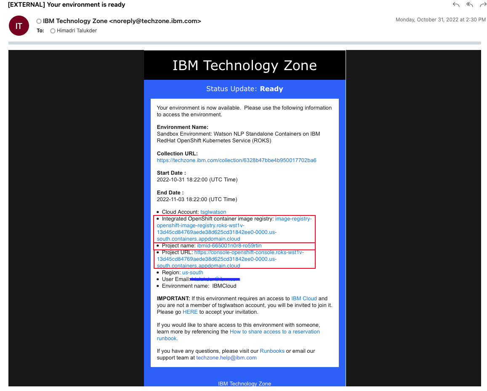

# Serve watson nlp model on a serverless Knative serving

With IBM Watson NLP, IBM introduced a common library for natural language processing, document understanding, translation, and trust. IBM Watson NLP brings everything under one umbrella for consistency and ease of development and deployment. This tutorial shows you how to build a stand-alone container image to serve Watson NLP models, and then run it on a ***Knative Serving*** in Openshift cluster.

***Knative*** is an Open-Source Enterprise-level solution to build Serverless and Event Driven Applications in Kubernetes / Openshift cluster. For more information please go [here](https://knative.dev/docs/).

The stand-alone container image includes both the Watson NLP Runtime as well as models. When the container runs, it exposes gRPC and REST endpoints that clients can use to run inference against the served models.

This tutorial uses pretrained models, however the approach can be adapted to serving custom models.

## Prerequisites

To follow this tutorial, you need:

- [Docker Desktop](https://docs.docker.com/get-docker/) installed
- [Python 3.9](https://www.python.org/downloads/) or later installed
- A Red Hat OpenShift cluster on which you can deploy an application, or you can reserve an [OpenShift Sandbox](https://github.com/ibm-build-lab/Watson-NLP/tree/main/MLOps/reserve-openshift-sandbox) to try out this tutorial
- A command-line interface -- Red Hat OpenShift (oc) installed and configured to talk to your cluster
- A Kubernetes or Red Hat OpenShift cluster with access to the [Watson NLP Runtime and pretrained models](https://github.com/ibm-build-labs/Watson-NLP/blob/main/MLOps/access/README.md#kubernetes-and-openshift)
- The [Watson NLP Runtime Python client library installed](https://github.com/ibm-build-labs/Watson-NLP/blob/main/MLOps/access/README.md#python)

**Tip:** Podman provides a Docker-compatible command-line front end. Unless otherwise noted, all of the Docker commands in this tutorial should work for Podman if you simply alias the Docker CLI with the alias docker=podman shell command.

## Steps

### Step 1. Install Knative

In this tutorial we are using OpenShift Serverless Operator for knative serving. There are two step processs to install knative serving

- [Install the OpenShift Serverless Operator](https://docs.openshift.com/container-platform/4.10/serverless/install/install-serverless-operator.html)
- [Install Knative Serving](https://docs.openshift.com/container-platform/4.10/serverless/install/installing-knative-serving.html)
- [Install the Knative CLI](https://knative.dev/docs/client/install-kn/)

### Step 2. Clone the GitHub repository

Clone the repository that contains the code used in this tutorial.

```sh
git clone https://github.com/ibm-build-labs/Watson-NLP
```

### Step 3. Build the container image

Build a container image to deploy. If you already have a stand-alone container image to serve pretrained or custom Watson NLP models that you prefer to use, you can skip this step.

3.1 Go to the build directory.

```sh
cd Watson-NLP/MLOps/Watson-NLP-Knative/runtime
```

3.2 There should be a Dockerfile in this directory. Run the build command.

```sh
docker build . -t watson-nlp-container:v1
```

This creates a Docker image called watson-nlp-container:v1. When the container runs, it should serve 2 pretrained models:

- sentiment_document-cnn-workflow_en_stock
- ensemble_classification-wf_en_emotion-stock

### Step 4. Copy the image to a container registry

To deploy this image in Kubernetes or Red Hat OpenShift cluster, you must first provision the image to a container repository that your cluster can access. Tag your image with proper repository and namespace/project names. Replace ***<REGISTRY>*** and ***<NAMESPACE>*** in the following commands based on your configuration.

**Note:** If you reserved a sandbox in the IBM TechZone, you will find ***<REGISTRY>*** and ***<NAMESPACE>*** in the confirmation email that you received when the sandbox was ready. See the following image.

***REGISTRY*** = Integrated OpenShift container image registry: you received in the email
  
***NAMESPACE*** = Project name: you received in the email



```sh
docker tag watson-nlp-container:v1 <REGISTRY>/<NAMESPACE>/watson-nlp-container:v1
```

Push the image to upstream.

```sh
docker push <REGISTRY>/<NAMESPACE>/watson-nlp-container:v1
```

### Step 5. Deploying the app in Red Hat OpenShift Knative serving

After the building the docker image and pushed to registry, you can deploy the app into your cluster.

During the creation of a Service, Knative performs the following steps:

- Create a new immutable revision for this version of the app.
- Network programming to create a Route, ingress, Service, and load balancer for your app.
- Automatically scale your pods up and down, including scaling down to zero active pods.

  
We can deploy the model in Knative serverless in two ways 
  
- using knative commandline tool `kn`
- standard Kubernetes manifest

I am going to show the both type of deployment. You may choose any of the method.
  
#### 5.1 Deploy using Knative commandline tool

In this deployment, we are using the image us.icr.io/watson-core-demo/watson-nlp-container:v1, is hosted in the IBM Container Registry. Please replace the image point to the one you built.

Create a knative service

```sh
kn service create watson-nlp-kn \
  --image us.icr.io/watson-core-demo/watson-nlp-container:v1 \
  --env ACCEPT_LICENSE=true
  --env LOG_LEVEL=debug
```

#### 5.2 Deploy using Kubernetes manifest

Go to the deployment directory.

```sh
cd deployment
```

In the directory, you should find a Kubernetes manifest called deployment.yaml which can be used to deploy the model service. The default image in this deployment, us.icr.io/watson-core-demo/watson-nlp-container:v1, is hosted in the IBM Container Registry. Before you start this service, you must update the image path in the Deployment to point to the registry you used.

```yaml
apiVersion: serving.knative.dev/v1
kind: Service
metadata:
  name: watson-nlp
  namespace: knative-serving
spec:
  template:
    metadata:
    spec:
      containers:
      - name: watson-nlp-runtime
        image: us.icr.io/watson-core-demo/watson-nlp-container:v1
        env:
        - name: ACCEPT_LICENSE
          value: 'true'
        - name: LOG_LEVEL
          value: debug
        ports:
        - containerPort: 8080
```
  
Note: Ensure that the container image value in service.yaml matches the container you built in the previous step.


5.2 Run it on Red Hat OpenShift

```sh
oc apply -f Runtime/deployment/deployment.yaml
```
