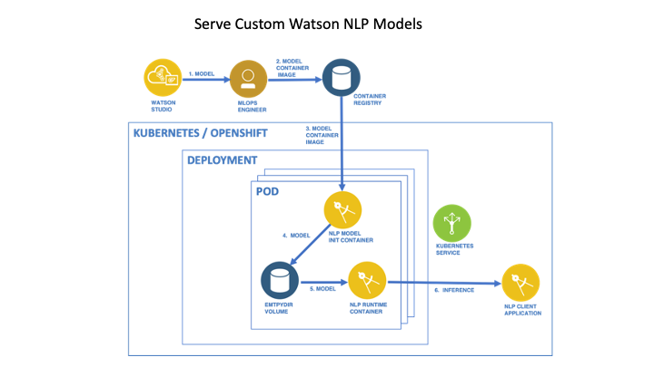

# Serving a Custom Model on a Kubernetes or OpenShift Cluster

In this tutorial you will take a Watson NLP model that you have trained in Watson Studio and serve it on a Kubernetes or OpenShift cluster. The model will be packaged as a container image using the [model builder](https://github.com/IBM/ibm-watson-embed-model-builder). The container images can be used in the same way as the pretrained Watson NLP models, i.e. specified as init containers of Watson NLP Runtime Pods.

To complete this tutorial, you need to have first completed the [Entity Extraction Model](https://github.com/ibm-build-lab/Watson-NLP/blob/main/ML/Entity-Extraction-Labeled/Train%20Entity%20Extraction%20Model.ipynb) notebook, which includes steps on training a Entity Extraction Modeland saving it to the Cloud Object Storage (COS) bucket associated with the project.

## Reference Architecture



## Prerequisites

- [Python 3.9](https://www.python.org/downloads/) or later is installed
- [Docker Desktop](https://docs.docker.com/get-docker/) is installed
- Docker has access to the [Watson NLP Runtime and pretrained models](https://github.com/ibm-build-lab/Watson-NLP/blob/main/MLOps/access/README.md#docker)
- You have a Kubernetes or OpenShift cluster on which you can deploy an application
- You have either the Kubernetes (`kubectl`) or OpenShift (`oc`) CLI installed, and logged into your cluster. The current namespace should be set to the namespace in which you will deploy the model service
- Your Kubernetes or OpenShift cluster has access to the [Watson NLP Runtime and pretrained models](https://github.com/ibm-build-lab/Watson-NLP/blob/main/MLOps/access/README.md#kubernetes-and-openshift)
- You have completed the [Entity Extraction](https://techzone.ibm.com/collection/watson-nlp-text-classification#tab-1) tutorial, and have saved the custom trained model named `sire_custom` to the COS bucket associated with the project. The tutorial uses this [notebook]([https://github.com/ibm-build-lab/Watson-NLP/blob/main/ML/Entity-Extraction-Labeled/Train%20Entity%20Extraction%20Model.ipynb](https://github.com/ibm-build-lab/Watson-NLP/blob/main/ML/Entity-Extraction-Labeled/Train%20Entity%20Extraction%20Model.ipynb)).

## Steps

### 1. Save your model

First, you will export your Watson NLP model from Watson Studio on IBM Cloud. In the IBM Cloud Pak for Data GUI, navigate to the page for your Consumer Complaints Classification project. Click on the **Assets** tab. There you should find a model named `ensemble_mode` stored as a ZIP file.

If the model is not there, go back to the notebook and ensure that you have followed the steps in the notebook:

- Insert a project token into the notebook, and
- Run the cell that saves the model.

```python
project.save_data('sire_custom', data=sire_custom.as_file_like_object(), overwrite=True)
```

Use the vertical ellipsis to the right of the model name to open a menu with the download option. Download the model to your local machine.

Next, we will unzip the file. Create a directory to unzip the file into.

```sh
mkdir models
```

```sh
mkdir models/ensemble_model
```

Unzip the file into the newly created directory. You may need to specify the path to the ZIP file if it is not in the current directory.

```sh
unzip ensemble_model -d models/sire_custom
```

it will look like below

```sh
models
└── sire_custom
    ├── config.yml
    ├── mentions
    │   ├── config.yml
    │   ├── entity-mentions_sire.bin
    │   └── extractor_0
    │       ├── config.yml
    │       └── executor.zip
    └── syntax
        └── config.yml
```

### 2. Build the model image

Prepare your Python environment.

```sh
python3 -m venv client-env
```

```sh
source client-env/bin/activate
```

Install the [model builder](https://github.com/IBM/ibm-watson-embed-model-builder) package.

```sh
pip install watson-embed-model-packager
```

Run the setup for the model builder package.

```sh
python -m watson_embed_model_packager setup \
    --library-version watson_nlp:3.2.0 \
    --local-model-dir /path/to/models \
    --output-csv model-manifest.csv
```

Ensure that you replace `/path/to/models` in the above command with the path to your `models` directory. This command will generate the file `model-manifest.csv` that will be used during the build.

Run the build command.

```sh
python -m watson_embed_model_packager build --config model-manifest.csv
```

This will create a Docker image with the name `watson-nlp_sire_custom`.

Verify the existence of this image:

```sh
docker images
```

### 3. Copy the model to a container registry

To deploy this image in Kubernetes or OpenShift cluster, you must first provision the image to a container repository. Tag your image with proper repository and namespace/project name. Replace `<REGISTRY>` and `<NAMESPACE>` in the following commands based on your configuration.

```sh
docker tag watson-nlp_ensemble_model:latest <REGISTRY>/<NAMESPACE>/watson-nlp_ensemble_model:latest
```

Push the image to the registry.

```sh
docker push <REGISTRY>/<NAMESPACE>/watson-nlp_sire_custom:latest
```

### 4. Serve the models

Clone the GitHub repository containing sample code for this tutorial.

```sh
git clone https://github.com/ibm-build-lab/Watson-NLP
```

Go to the directory for this tutorial.

```sh
cd Watson-NLP/MLOps/custom-model-k8s
```

Open the Kubernetes manifest for editing.

```sh
vim deployment/deployment.yaml
```

Update the init container line in the file to point to your custom model image.

```yaml
    spec:
      initContainers:
      - name: ensemble-model
        image: <REGISTRY>/<NAMESPACE>/watson-nlp_sire_custom:latest
```

Create a [secret](https://kubernetes.io/docs/tasks/configure-pod-container/pull-image-private-registry/#registry-secret-existing-credentials) in the namespace to give credentials to the registry used, and [add this secret](https://kubernetes.io/docs/tasks/configure-pod-container/pull-image-private-registry/#create-a-pod-that-uses-your-secret) to the `imagePullSecrets` section, so that your Pod can pull the image from the registry.

Deploy the model service.

If using Kubernetes:

```sh
kubectl apply -f deployment/deployment.yaml
```

If using OpenShift:

```sh
oc apply -f deployment/deployment.yaml
```

The model service is now deployed.

### 5. Test the service

Run a simple Python client program to test that the model is being served. Note that the client code is specific to the model. If you serve a different model you will need to update the client program.

Install the Python client library on your machine.

```sh
pip install watson_nlp_runtime_client
```

Enable port forwarding from your local machine.

If running the service in a Kubernetes cluster:

```sh
kubectl port-forward svc/watson-nlp-runtime-service 8085
```

For OpenShift:

```sh
oc port-forward svc/watson-nlp-runtime-service 8085
```

Go to the directory with the client program and run it.

```sh
cd Client
```

Run the program with a single string argument.

```sh
python3 client.py 'I work at California and Portland.'
```

The program will return output similar to the following.

```sh
###### Calling GRPC endpoint =  localhost:8085
###### Calling remote GRPC model =  sire_custom
mentions {
  span {
    begin: 10
    end: 20
    text: "California"
  }
  type: "Duration"
  confidence: 0.989479959
}
mentions {
  span {
    begin: 25
    end: 33
    text: "Portland"
  }
  type: "Location"
  confidence: 0.999098361
}
producer_id {
  name: "Entity-Mentions SIRE Workflow"
  version: "0.0.1"
}
```
