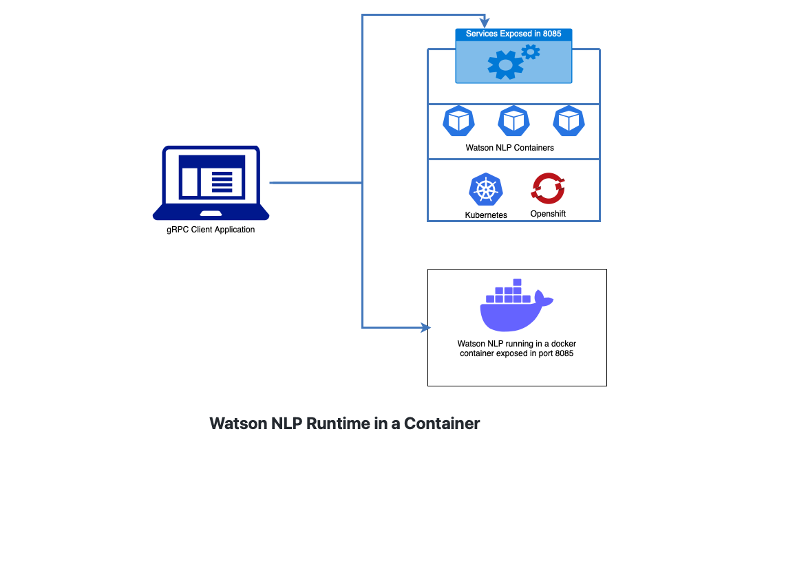

# Watson NLP Runtime in a Container
In this directory, we will learn how to serve pre-trained Watson NLP models from a standalone container.  For the examples, we will use stock models for Sentiment Analysis and Emotion Classification.

By standalone container, we mean that the container image is self-contained and includes both ML models and the model runtime.  When the container runs it exposes REST and gRPC endpoints that a client program can use to run scoring against the models.  

Standalone containers are useful since they can be deployed in a variety of contexts.  

In this tutorial, we will deploy locally with Docker, which can be convenient for development.  As well, we will deploy on a Kubernetes or OpenShift cluster.In addition to serving the models, this tutorial demonstrates how to testing the service by running a simple Python client program.

## Architecture diagram



## Prerequisites
- Docker is installed on your workstation
- Python >= 3.9 installed in your workstation to run the client program
- An [IBM Artifactory](https://na.artifactory.swg-devops.com/ui/admin/artifactory/user_profile) user name and API key are required to build the Docker image. Get an Artifactory Api key from [here](https://taas.w3ibm.mybluemix.net/guides/create-apikey-in-artifactory.md) and set the following variables in your environment.
  - ARTIFACTORY_USERNAME 
  - ARTIFACTORY_API_KEY
```
export ARTIFACTORY_USERNAME=<USER_NAME>
export ARTIFACTORY_API_KEY=<API_KEY>
```
## Build and Run the Server

Clone the git repo  
```
git clone https://github.com/ibm-build-labs/Watson-NLP 
```
### 1. Build server Docker image
Go to the directory `Watson-NLP-Container/Runtime`  and run the following command. It will create a Docker image `watson-nlp-container:v1`.

```
cd Watson-NLP-Container/Runtime
```
```
docker build . \
--build-arg WATSON_RUNTIME_BASE="wcp-ai-foundation-team-docker-virtual.artifactory.swg-devops.com/watson-nlp-runtime:0.13.1_ubi8_py39" \
--build-arg MODEL_NAMES="ensemble_classification-wf_en_emotion-stock sentiment_document-cnn-workflow_en_stock" \
--build-arg ARTIFACTORY_API_KEY=$ARTIFACTORY_API_KEY \
--build-arg ARTIFACTORY_USERNAME=$ARTIFACTORY_USERNAME \
-t watson-nlp-container:v1
```
**Note**: Three build arguments are required. Please pass the parameters correctly when you build the docker image.
***ARTIFACTORY_USERNAME***=Artifactory username to download the base image 
***ARTIFACTORY_API_KEY***=Artifactory API key to download the base image 
***MODEL_NAMES argument*** is the ML model you want to include in the container. You can pass multiple model names with space separated. 

### 1.1 Run the server locally
Use the following command to start the server on your local machine.
```
docker run -d -p 8085:8085 watson-nlp-container:v1
```
The gRPC service will be exposed locally on port 8085.

### 1.2 Run the server in an OpenShift or Kubernetes cluster
Alternatively, you can run the service on an OpenShift or Kubernetes cluster.  Ensure that you have access to the cluster and that you have either Kubernetes (`kubectl`) or OpenShift (`oc`) CLI installed on your local machine.

Assuming that the Docker file you created in step 1 is accessible in your OpenShift/k8 cluster. Change the Docker image repo in the `Runtime/Deployment/deployment.yaml` file.  Run the below commands to deploy in the cluster from the project root directory **Watson-NLP-Container**.
#### Install in a OpenShift cluster
```
oc apply -f Runtime/deployment/deployment.yaml
```
Check that the pod and service are running.
```
oc get pods
oc get svc
```
#### Install in a Kubernetes cluster
```
kubectl apply -f Runtime/deployment/deployment.yaml
```
Check that the pod and service are running.
```
kubectl get pods
kubectl get svc
```
## 2 Test the Watson NLP Runtime with a Python client
In order to run this application you need to gain access to Artifactory to install the below client libraries:
- **watson_nlp_runtime_client:** it is a packaged gRPC stub library to communicate to the watson nlp runtime

**Install python library**
``` 
pip3 install watson_nlp_runtime_client
```

- Create a gRPC channel
- Create a request object
- Call the model by passing model id

Example code can be found in [GrpcClient](https://github.com/ibm-build-labs/Watson-NLP/blob/main/Watson-NLP-Container/Client/GrpcClient.py).

Running the client depends on how the server was started.

### 2.1 Server runs in local Docker container
Go the Client directory from project Watson-NLP-Container and pass the input text as a parameter to get sentiment and emotion analysis. 
```
cd Watson-NLP-Container/Client
```
```
python3 client.py "Watson NLP is awesome"
```
### 2.2 Server runs in OpenShift/k8 cluster
First do a port forwarding to access the Watson NLP Runtime.

#### In Openshift:
```
oc port-forward svc/watson-nlp-container 8085
```
#### In kubernetes:
```
kubectl port-forward svc/watson-nlp-container 8085
```

#### Running Python Client. 

```
cd Client
python3 client.py "Watson NLP is awesome"
```

#### Output
```
classes {
  class_name: "joy"
  confidence: 0.9687168002128601
}
classes {
  class_name: "anger"
  confidence: 0.03973544389009476
}
classes {
  class_name: "fear"
  confidence: 0.030667975544929504
}
classes {
  class_name: "sadness"
  confidence: 0.016257189214229584
}
classes {
  class_name: "disgust"
  confidence: 0.0033179237507283688
}
producer_id {
  name: "Voting based Ensemble"
  version: "0.0.1"
}

score: 0.9761080145835876
label: SENT_POSITIVE
sentiment_mentions {
  span {
    end: 21
    text: "Watson NLP is awesome"
  }
  score: 0.9761080145835876
  label: SENT_POSITIVE
}
producer_id {
  name: "Document CNN Sentiment"
  version: "0.0.1"
}
```
