# ML Tutorial

If you don't have access to TZ, you can still complete this lab using your own IBM cloud account.

## Perform Emotion Classification using Watson NLP

In this tutorial, you will learn to use the Watson NLP library to perform emotion classification in a Watson Studio environment. You will use your own Watson Studio (CPD) instance here.

### Step 1: Setup your own Watson Studio (CPD) Environment

In this step you will setup your own Watson Studio environment for using the Watson NLP models via TechZone. The Watson Studio project has been pre-packaged with the required Notebooks, data assets and runtime environment configuration.

1. Log in to [IBM Cloud Pak for Data](https://dataplatform.cloud.ibm.com/home2?context=cpdaas). Click on the **Login** button and sign in. 

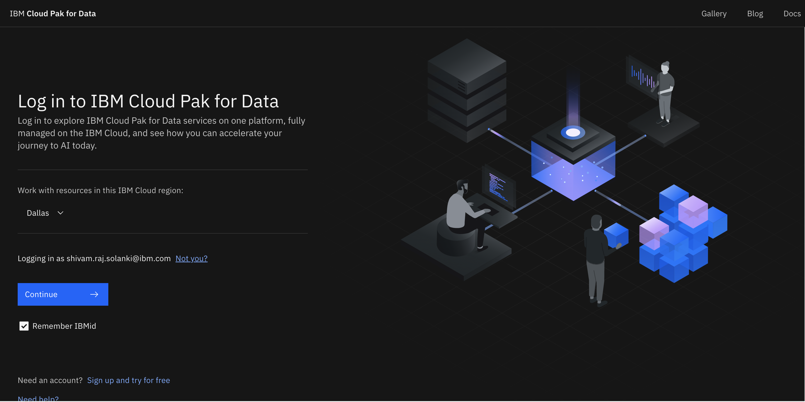

**Note**: If you see an error message after logging in, please reload/refresh the browser webpage)

2. On the Project tile, click on the **+** button to Create New project. 

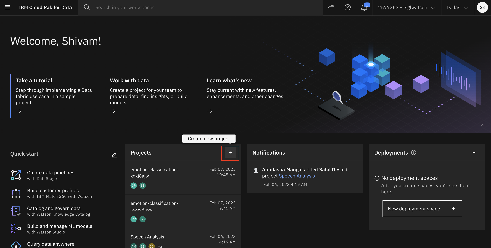

3. Select the option **Create a project from a sample or file**

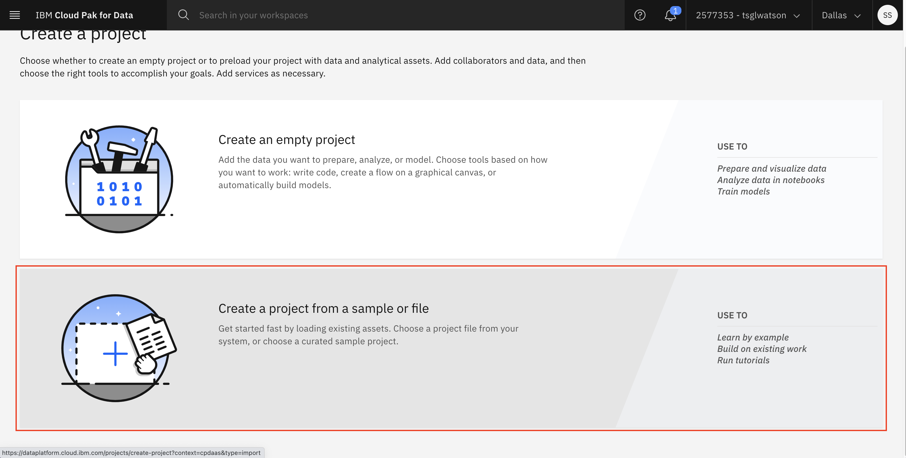

4. Download the project zip file from GitHub: https://github.com/ibm-ecosystem-engineering/Watson-NLP/blob/main/ML/Emotion-Classification/Emotion-Classification.zip

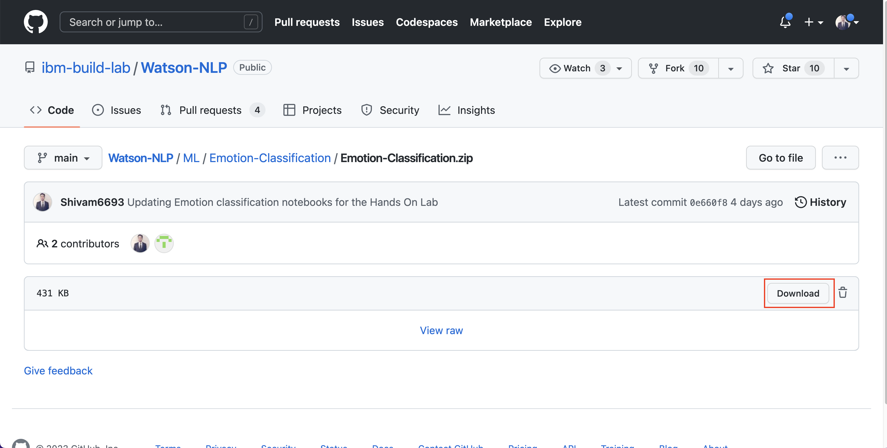

5. Go to Create a Project page in Watson Studio (CPD) and upload your recently downloaded zip file. Then enter the name of **Emotion Classification** and Add or select your storage service. Finally click **Create**

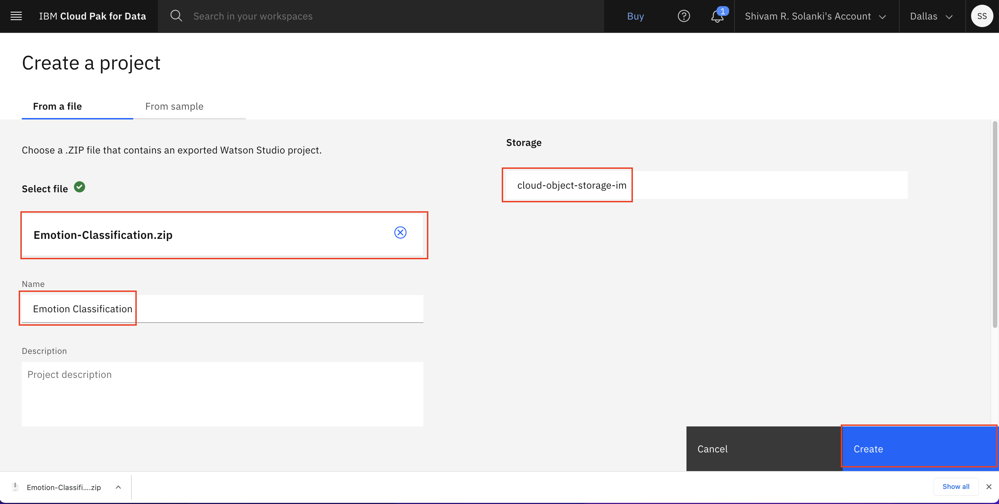

6. You will see the notification once the project is created for you. Click on **View new project**.

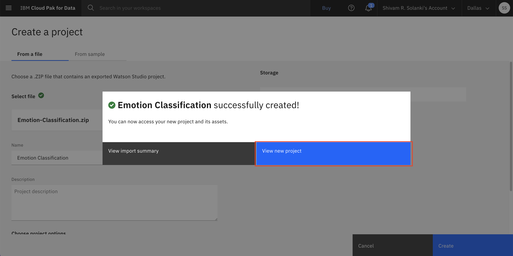

7. After the project is opened, you can view the notebooks and data assets of the project by using the **Assets** tab.

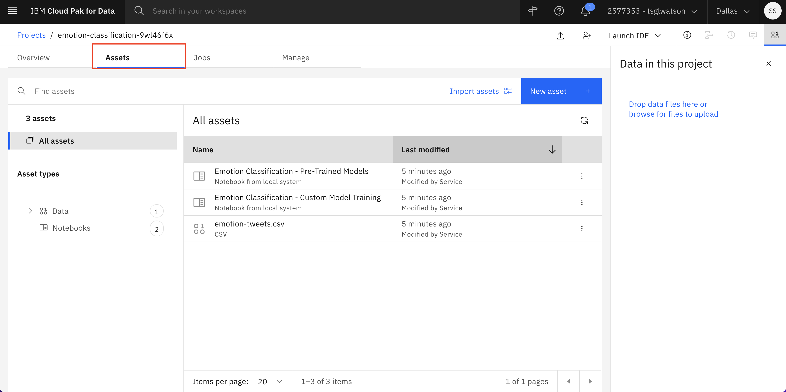

    This Watson Studio (CPDaaS) instance consists of the following:

1. **Emotion Classification - Custom Model Training**: A notebook for training a custom model for emotion classification
2. **Emotion Classification - Pre-Trained Models**: A notebook for using a pre-trained Emotion classification model from the Watson NLP librar
3. **emotion-tweets.csv**: The dataset on which you will train/test your emotion classification models

### Step 2: Create an Access token for using the Project library in the notebook

In this step you will create an access token which is required for using the Project library in the notebook. The project library provides you with the capabilities of loading and saving file to and from the notebook.

1. To begin, click on the **Manage** tab.

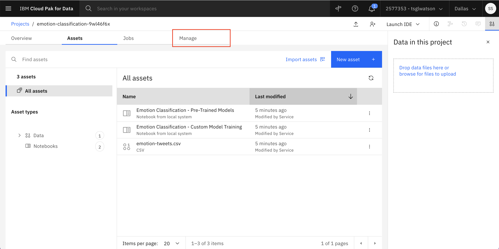

2. Switch to the **Access control** tab on the left, then select **Access tokens** and click **New access token +**.

3. Enter a **Name** for the access token, and select **Editor** in the Access role. Then, click **Create**. Now the access token is created for you and you can use it in the notebook.

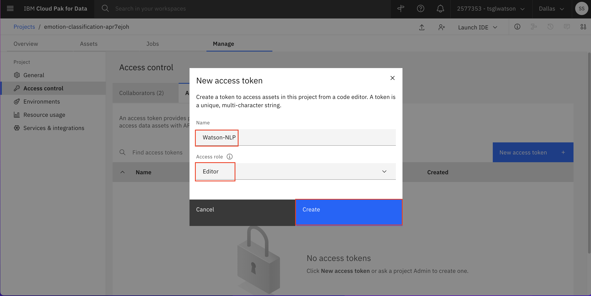

### Step 3. Execute the Pre-trained model notebook

Now you will run the notebook and learn how to use a pre-trained model for emotion classification using the Watson NLP library.

1. Click on the **Assets** tab, and find the notebook **Emotion Classification - Pre-Trained Models**. Click the ellipsis (the three dots) to the right of the notebook name to open a drop-down menu. Within this menu, click **Edit**

2. Once your notebook loads, you can just insert the project token as shown in the following image.

2. After inserting the project token, you can step through the notebook cell by cell. To execute a cell, select the cell and then hit **Shift+Enter** or click on the **Cell** menu and select **Run Cells**

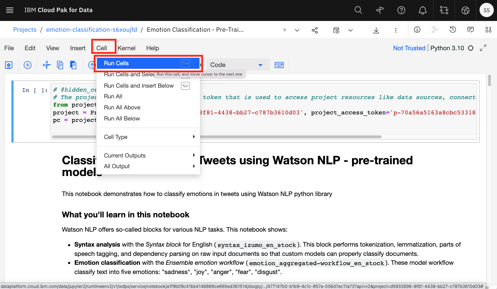

**Note**: To see if the cell is executing/running - look for the __*__ symbol to the left of the cell in brackets which indicates that the cell is currently executing. Also, you can check the circle on the top right of the notebook which turn solid when any of the cells in the notebook is currently running.

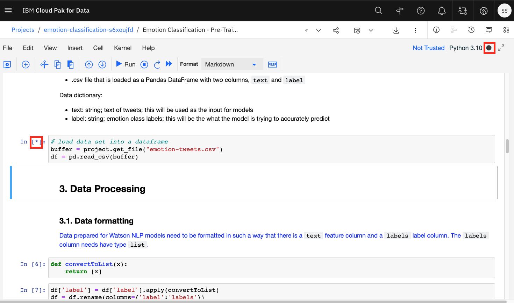

3. Alternatively, you can click on the **Cell** Menu and select **Run All**. This will execute all the cells in the notebook and will take approximately 20 minutes. You can scroll down slowly to observe the outputs of each cell.

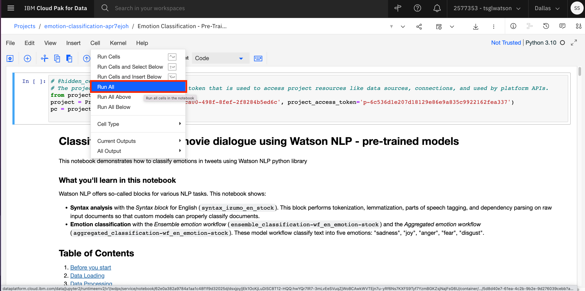

You can follow the instructions in your notebook to complete the Emotion Classification tutorials using the Watson NLP library.

## Take Home exercise
### Execute the Custom model training notebook

In the take home exercise, you will be training a custom model for emotion classification using the Watson NLP library. 
Follow these steps to build a custom trained model that will be deployed in the MLOps lab:

1. Repeat the under the **Step 2 - Setup the recently created environment** for the **Emotion Classification - Custom Model Training** notebook

2. Then repeat the steps under **Step 3. Execute the Pre-trained model notebook**

A detailed tutorial for Emotion Classification can be found here - https://developer.ibm.com/tutorials/use-the-watson-nlp-library-to-perform-emotion-classification/

