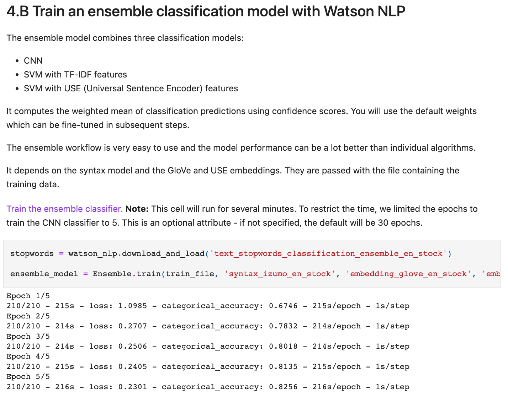

# Self-Serve Assets for Embed using Watson NLP

[Assets/Accelerators for Watson NLP](https://github.com/ibm-build-labs/Watson-NLP) (this repo) contains self-serve notebooks and documentation how to create build NLP models using Watson NLP library, how to deploy Watson NLP containers and how to access them from custom applications. With an IBM Cloud account a full production sample can be deployed in roughly one hour.

🔴 IMPORTANT: At this point this functionality is experimental only and subject to change.

Key Technologies:
* [IBM Watson NLP](https://ibmdocs-test.mybluemix.net/docs/en/watson-libraries?topic=watson-natural-language-processing-home) (Natural Language Processing) comes with a wide variety of text processing functions, such as emotion analysis and topic modeling. Watson NLP is built on top of the best AI open source software. Additionally it provides stable and supported interfaces, it handles a wide range of languages and its quality is enterprise proven. The cloud-native Watson NLP containers can be deployed on various Kubernetes based platforms.

## Outline

All the Machine Learning notebooks, tutorials, and dataset are under the [ML folder](ML/) and the MLOps assets are under the [MLOps folder](MLOps/). Go to the respective folders to learn more about the assets development and deployment.

* [ML Assets](ML/)
    * [Emotion Classification](ML/Emotion-Classification/)
        * [Emotion Classification Tutorial](ML/Emotion-Classification/Emotion%20Classification%20Tutorial.md)
        * [Emotion Classification Pre-trained notebook](ML/Emotion-Classification/Emotion%20Classification%20-%20Pre-Trained%20Models.ipynb)
        * [Emotion Classification Custom trainining notebook](ML/Emotion-Classification/Emotion%20Classification%20-%20Custom%20Model%20Training.ipynb)
        * [Emotion Classification dataset](ML/Emotion-Classification/emotion-tweets.csv)
    * [Entities & Keywords Extraction](ML/Emotion-Classification/)
        * [Entities, Keywords & Phrases extraction tutorial](ML/Entities-Keywords-Extraction/Entities-extraction-tutorial.md)
        * [Entities, Keywords & Phrases extraction notebook](ML/Entities-Keywords-Extraction/Hotel%20Reviews%20Analysis%20-%20Entities%20and%20Keywords.ipynb)
        * [Belgrave Hotel dataset](ML/Entities-Keywords-Extraction/uk_england_london_belgrave_hotel.csv)
        * [Dorset Hotel dataset](ML/Entities-Keywords-Extraction/uk_england_london_dorset_square.csv)
        * [Euston Hotel dataset](ML/Entities-Keywords-Extraction/uk_england_london_euston_square_hotel.csv)
    * [Sentiment Analysis](ML/Sentiment-Analysis/)
        * [Sentiment Analysis Tutorial](ML/Sentiment-Analysis/Sentiment%20Analysis%20Tutorial%20extended.md)
        * [Sentiment Analysis Pre-trained notebook](ML/Sentiment-Analysis/Sentiment%20Analysis%20-%20Pre-Trained%20models.ipynb)
        * [Sentiment Analysis Fine-tune/re-training Notebook](ML/Sentiment-Analysis/Sentiment%20Analysis%20-%20Model%20Training.ipynb)
        * [Sentiment Analysis dataset](ML/Sentiment-Analysis/movies_small.csv)
    * [Text Classification](ML/Text-Classification)
        * [Text Classification Tutorial](ML/Text-Classification/Text-Classification-Tutorial.md)
        * [Consumer complaint text classification notebook](ML/Text-Classification/Consumer%20complaints%20Classification.ipynb)
        * [Hotel Reviews text classification](ML/Text-Classification/Hotel%20Reviews%20Classification.ipynb)
    * [Topic Modeling](ML/Topic-Modeling)
        * [Topic Modeling tutorial](ML/Topic-Modeling/Topic-Modeling-Tutorial.md)
        * [Topic Modeling Notebook](ML/Topic-Modeling/Complaint%20Data%20Topic%20Modeling.ipynb)
        * [Topic Modeling comparison with LDA Notebook](ML/Topic-Modeling/Complaint%20Data%20Topic%20Modeling%20-%20Compare%20With%20LDA.ipynb)
    * [Dash Apps](ML/Dash-App)
        * [Dash App for Sentiment & Emotion Classification](ML/Dash-App/Sentiment_dash_app.py)
        * [Dash App for Topic Modeling](ML/Dash-App/Topic_dash_app.py)
        * [Dash App for Entities Extraction](ML/Dash-App/Entity_extraction_dash_app.py)
        * [Dash App for Text Classification](ML/Dash-App/Text_classification_dash_app.py)
* [MLOps Assets](MLOps/)
    * []

**Happy Path**

The steps below describe the 'happy path' for Data Science Engineers, Developers and MLOps engineers to train and save an NLP model (text classification) using Watson NLP in the Watson Studio env, deploy a saved model on Containerized env as easily as possible. At the end of the happy path the following assets will be built, service and application components will have been deployed:

1. Sandbox Watson Studio env on IBM Cloud 

2. Watson Studio Notebook for training the model using Watson NLP library 

3. Watson NLP pod ([screenshot](documentation/Screenshots/openshift-03.png))
  * Runtime container which provides gRCP and REST interfaces via a service
  * One model container for syntax predictions
4. Sample consumer application pod ([screenshot](documentation/Screenshots/openshift-08.png))
  * UBI container which is configured to run a command which invokes the Watson NLP runtime container via REST
5. Snippets to invoke Watson NLP via gRCP and REST from a local environment ([screenshot](documentation/Screenshots/validation-01.png))

## Resources

* IBM Watson NLP
  * **TO BE DONE** Announcement
  * [Documentation](https://ibmdocs-test.mybluemix.net/docs/en/watson-libraries?topic=watson-natural-language-processing-home)
  * [Watson NLP Helm Chart](https://github.com/cloud-native-toolkit/toolkit-charts/tree/main/stable/watson-nlp)
  * **TO BE DONE** [Syntax model](https://ibmdocs-test.mybluemix.net/docs/en/watson-libraries?topic=models-syntax)
  * [Samples](https://github.com/ibm-build-labs/Watson-NLP)
* [IBM Embeddable AI Home Page](https://dce.blabs.cloud/) **TO BE DONE**
* IBM Technology Zone assets
  * [Watson NLP - Text Classification](https://techzone.ibm.com/collection/watson-nlp-text-classification)
  * [Watson NLP - Entities & Keywords extraction](https://techzone.ibm.com/collection/watson-nlp-entities-keywords-extraction)
  * [Watson NLP - Topic Modeling](https://techzone.ibm.com/collection/watson-nlp-topic-modeling)
  * [Watson NLP - Sentiment and Emotion Analysis](https://techzone.ibm.com/collection/watson-core-nlp)
  * [Embeddable AI](https://techzone.ibm.com/collection/embedded-ai)
  * [Watson NLP - Creating Client Applications](https://techzone.ibm.com/collection/watson-nlp-creating-client-applications)
  * [Watson NLP - Serving Models with Standalone Containers](https://techzone.ibm.com/collection/watson-nlp-serving-models-with-standalone-containers)
  * [Watson NLP - Serving Models with Kubernetes and OpenShift](https://techzone.ibm.com/collection/watson-nlp-serving-nlp-models)
* IBM Developer Tutorials
  * [Set up your Watson NLP Environment](https://developer.ibm.com/tutorials/set-up-your-ibm-watson-libraries-environment/)
  * [Use the Watson NLP library to perform Emotion Classification](https://developer.ibm.com/tutorials/use-the-watson-nlp-library-to-perform-emotion-classification/)
  * [Use the Watson NLP library to perform Sentiment Analysis](https://developer.ibm.com/tutorials/use-the-watson-core-nlp-library-to-perform-sentiment-analysis/)
